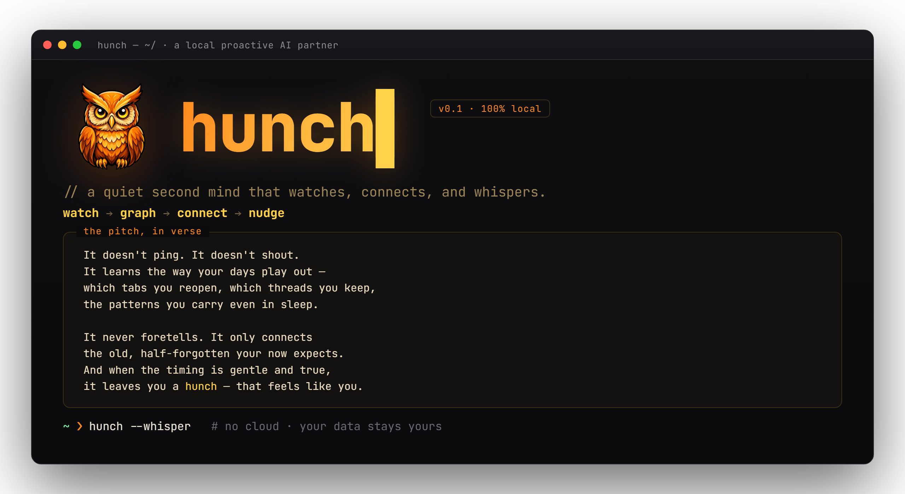

<p align="center">
  
</p>

<h1 align="center">🧠 Hunch</h1>
<p align="center"><em>a quiet second mind — it watches, connects, and whispers.</em></p>

---

A self-contained **proactive AI partner** that runs locally on your PC. Inspired by the "Machine" from *Person of Interest* — but honest about what's real vs sci-fi.

> *It doesn't ping. It doesn't shout.*
> *It learns the way your days play out —*
> *which tabs you reopen, which threads you keep,*
> *the patterns you carry even in sleep.*
>
> *It never foretells. It only connects*
> *the old, half-forgotten your now expects.*
> *And when the timing is gentle and true,*
> *it leaves you a hunch — that feels like you.*

It quietly watches your activity, learns your patterns and how your topics connect, and — when your current focus lines up with something useful from your past — sends you a subtle, well-timed nudge that feels like your own thought.

No cloud. No external memory service. Everything stays in a local SQLite DB on your machine.

## What it actually does

```
WATCH ──▶ STORE ──▶ BASELINE ──▶ GRAPH ──▶ DETECT ──▶ GATE ──▶ BRAIN ──▶ nudge
```

1. **Watch** — active window/app, browser history, opened files, clipboard, active times. Logs only on change (no spam).
2. **Baseline** — builds a *pattern of life*: your rhythm, apps, recurring topics & entities.
3. **Graph** — a self-built knowledge graph (entities = nodes, co-occurrence = edges) so it knows what relates to what. Dot-connecting in < 1 s.
4. **Detect** — compares "what you're on right now" vs your baseline + graph → opportunities ("your focus connects to X"), spikes, dormant-project revival, unusual hours.
5. **Gate** — quality filter: score threshold + quiet hours + min gap between nudges. So it never spams you.
6. **Brain** — turns a worthwhile signal into a casual, subtle nudge (via `claude -p`) and sends it to your Telegram.

> The honest part: it does **not** predict problems weeks ahead from invisible micro-anomalies. It connects your *real* signals — which already feels surprisingly prescient.

## Cold start: it reads your whole past

On the **first run after install, Hunch bootstraps itself once** — automatically, no command needed. It pulls everything in so it doesn't start blind:

- **Your archives** (`ingest_sources`) — notes, memories, history you point it at.
- **Every Claude Code session you've ever had** — word for word. Hunch reads the local session transcripts (`~/.claude/projects/**/*.jsonl`, which Claude Code writes itself) and pulls each message with its real timestamp, role, **response time** (the gap to the previous turn), answer type, and an **emotion proxy**.

Then it builds the baseline + graph and comes up to full speed.

> **The emotion proxy is honest, not magic.** There's no real feeling-scanner. It's a transparent heuristic over written tone — ALL-CAPS, exclamation marks, swear/dismissive words (frustration) vs. hype words (excitement), terseness — giving each message a label + polarity + arousal. It reads your conversational *rhythm and mood over time*, nothing more. Generic & language-light (DE+EN lexica), tunable in `emotion.py`.
>
> Noise is filtered the right way (generically, not by hardcoding): sub-agent turns (`isSidechain`), automated/cron/SDK turns (`entrypoint`/`promptSource`), hook injections, tool output, and slash-command bodies are tagged or skipped — so the mood profile reflects *you typing*, not the machinery.

Session sync is **incremental** afterwards — only changed transcripts are re-read — and runs read-only. Default source `~/.claude/projects` works for any Claude Code user; add more paths via `session_sources` in `config.local.json`.

## Setup

1. **Deps:** `pip install pywin32 psutil` (Windows). Needs the `claude` CLI on PATH for nudge phrasing.
2. **Config:** copy `config.example.json` → `config.local.json` and fill in:
   - `chat_id` — your Telegram chat id (or set env `MACHINE_CHAT_ID`)
   - `bot_token` — your Telegram bot token (or env `MACHINE_BOT_TOKEN`)
   - `user_desc` — a short description of you (shapes the nudge style)
   - `ingest_sources` — optional paths to your own notes/archives as cold-start material
   - `quiet_hours`, `nudge_min_score`, `nudge_min_gap_min` — tune to taste
3. **Run:**
   ```
   python -m hunch.run            # foreground loop (watcher + scheduler)
   python -m hunch.run --install-task    # autostart at logon (Startup folder, no admin)
   python -m hunch.run --health   # is it alive?
   ```

## Query it

Either the CLI or the `/machine` slash command (Claude Code plugin):

```
/hunch status          # is it live? what does it see right now?
/hunch scan            # current signals
/hunch why <name>      # how something connects in the graph
/hunch profile         # your pattern of life
/hunch sync [--full]   # pull your Claude Code sessions into the store
/hunch mood            # your mood over time (emotion proxy across sessions)
/hunch share           # multi-agent state: who's the brain, shared profile
/hunch note <text>     # contribute an observation to the shared inbox
/hunch nudge           # force a nudge now
```

Bootstrap/sync directly:

```
python -m hunch.run --bootstrap        # force the one-time cold start (ingest + all sessions + rebuild)
python -m hunch.session_sync --full    # (re)sync every session from scratch
```

## Multi-agent: one writer, many readers

Running several AI agents (on the same box or across Windows + WSL) and want them all to know you better — **without trampling each other**? Hunch is built for that, on a simple rule: **one writer, many readers.**

- **One brain.** Exactly one Hunch instance writes the store and publishes the profile. A cooperative, heartbeat-based lock (`share/brain.lock`) guarantees it: whoever doesn't see a fresh foreign lock becomes the brain, everyone else becomes a `reader`. No two brains, no DB races. (`role: auto|brain|reader`.)
- **Everyone reads.** The brain publishes `hunch_profile.json` (structured) + `hunch_profile.md` (readable) to a shared folder (`share_dir`, default `~/hunch-share` — reachable from Windows *and* WSL). Any agent just reads that file. Reading can never collide, from any number of agents.
- **Everyone contributes — conflict-free.** Each agent appends its observations to **its own** file in the inbox (`inbox/<agent>.jsonl`). Separate files = zero write contention. The brain folds them into the shared profile on its cycle (incremental, deduped). Non-Python agents don't even need Hunch — they just append one JSON line:

  ```json
  {"ts": 1750000000, "agent": "my-agent", "text": "user keeps reopening the pricing page", "tags": ["sales"]}
  ```

So a fleet of agents builds one shared understanding of you, and a crash or a second brain can't corrupt it.

## Privacy

Everything is **local**. The watcher captures a lot (that's the point) — it all lives in `data/hunch.db` on your machine and is never uploaded. The only outbound traffic is the nudge to *your own* Telegram. `config.local.json`, the DB, and `.env` are gitignored and never leave your repo.

## Off switch

```
python -m hunch.run --uninstall-task   # remove autostart
# then kill the process listed in data/runtime.pid
```

## Layout

```
hunch/
  config.py        # config (env / config.local.json — no secrets in code)
  store.py         # SQLite store (+ bulk upserts)
  watcher.py       # PC signal collector
  ingest.py        # cold-start import of your archives
  session_sync.py  # pulls Claude Code session transcripts (word-for-word + metadata)
  emotion.py       # emotion proxy (tone heuristic, DE+EN)
  baseline.py      # pattern-of-life profile
  graph.py         # knowledge graph + dot-connecting
  detect.py        # anomaly / opportunity detection
  brain.py         # nudge engine (Gemini CLI / claude / templates) + Telegram
  share.py         # multi-agent: publish profile + brain-lock (one writer, many readers)
  inbox.py         # multi-agent: append-only contributions from other agents
  cli.py           # status / scan / why / profile / sync / mood / share / note / nudge
  run.py           # runtime launcher + bootstrap + autostart + health
commands/hunch.md  # /hunch slash command
```

MIT.
